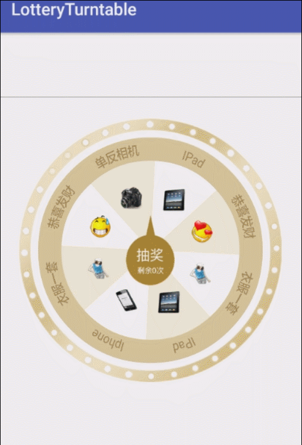

# LotteryTurntable
抽奖转盘自定义实现

实现效果

####其中使用的一些方法：

1、
	//传入的参数由后台返回指定中哪个奖项

      mLuckSpan.luckyStart(0); //参数是指定中奖的奖项

2、

	//逐渐停止转盘

      mLuckSpan.luckStop(); //调用该方法后 转盘会逐渐的停下来并指定到指定的奖项

3、设置 转动的监听 

	mLuckSpan.setOnSpanRollListener(new LuckSpan.SpanRollListener() {
            @Override
            public void onSpanRollListener(double speed) {
                if (0 == speed) {
                    //已经停止下来了 提示中奖名并释放按钮
                    mIvStart.setEnabled(true);
                    if (mIsClickStart) {
                        runOnUiThread(new Runnable() {
                            @Override
                            public void run() {
                                Toast.makeText(getApplicationContext(), "恭喜你中奖了", Toast.LENGTH_SHORT).show();
                                mIsClickStart = false;
                            }
                        });
                    }
                }
            }
        });

####具体实现

	具体的实现其实就是利用SurfaceView自定义，详细请看代码，可以自定义修改，注释跟详细